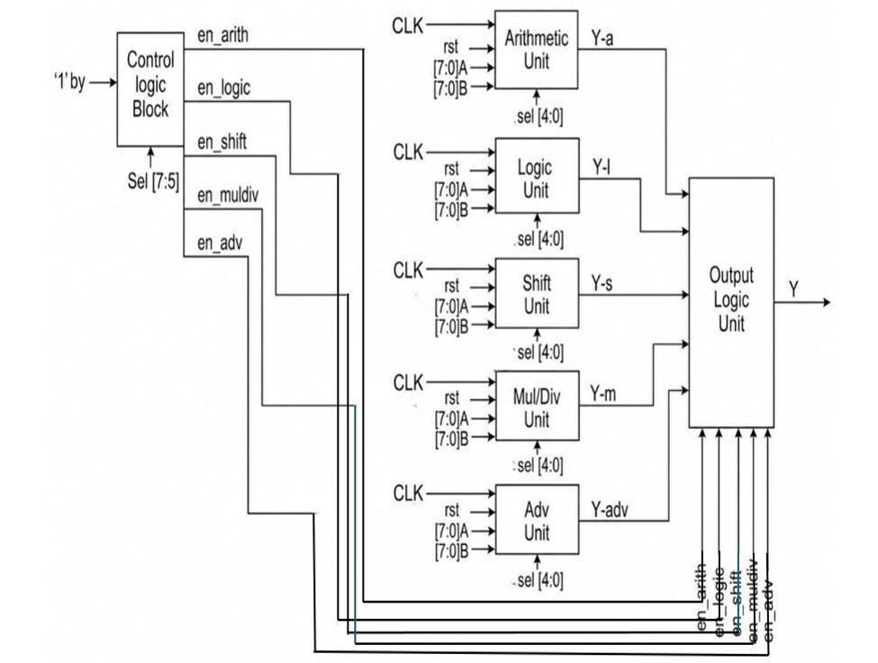
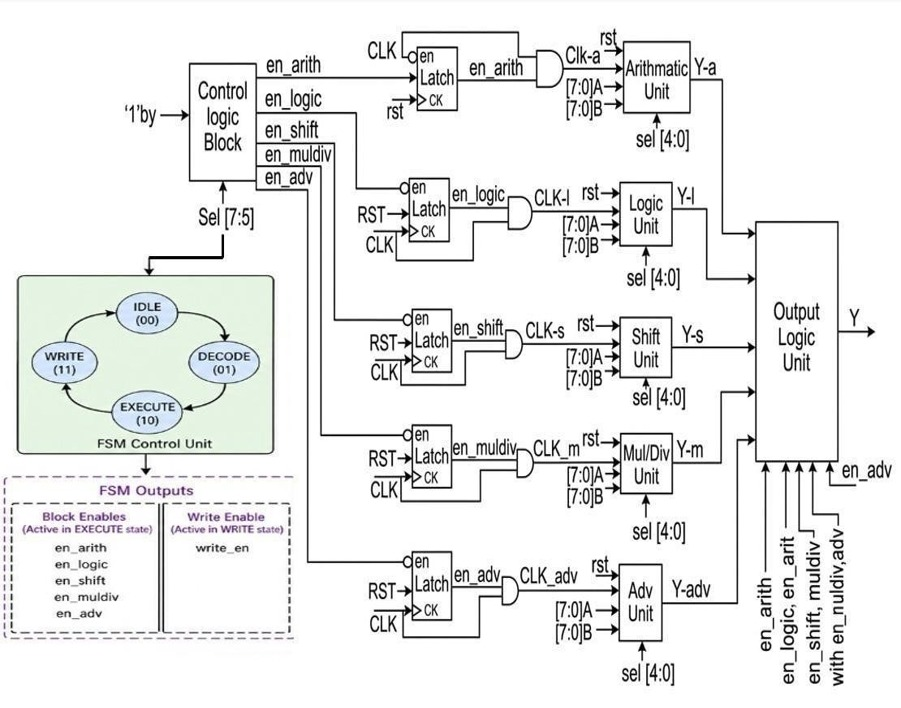
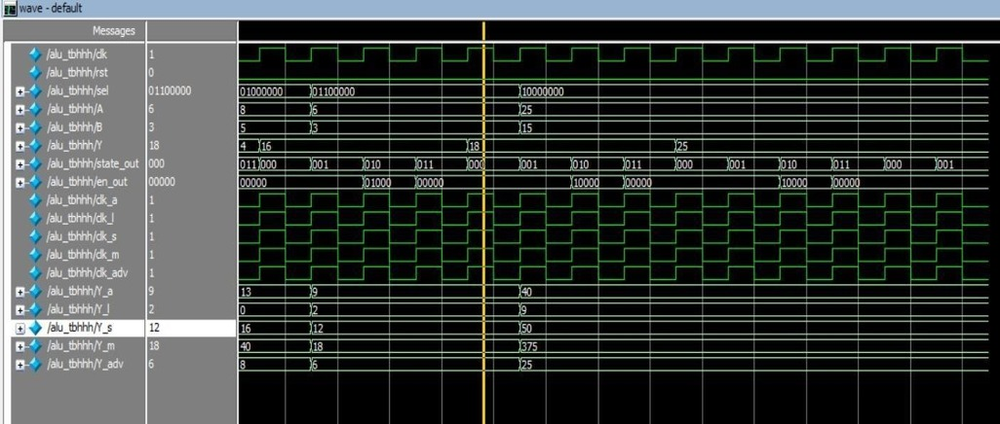
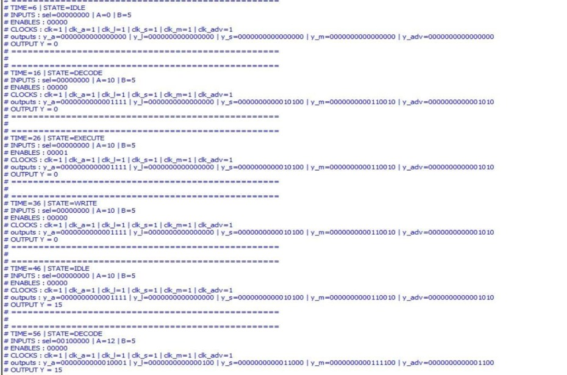
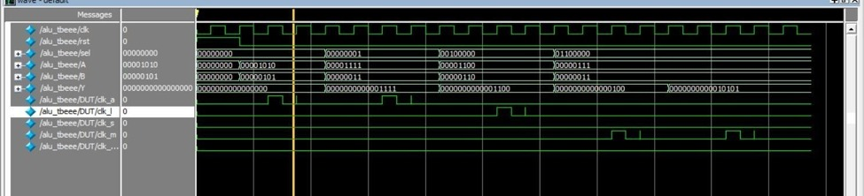
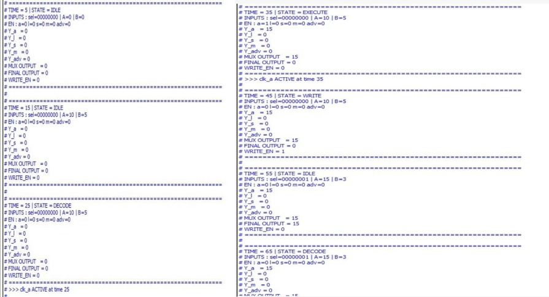
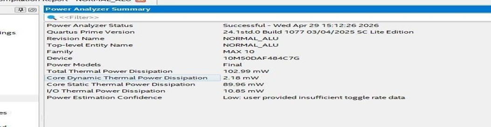
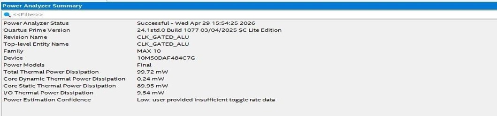

# Low-Power Clock Gated ALU

## Overview

This project implements a Low-Power Arithmetic Logic Unit (ALU) using Clock Gating in Verilog HDL.

The design reduces unnecessary clock switching by enabling the clock only for the functional unit selected by the control logic. This helps reduce dynamic power consumption while maintaining correct ALU functionality.

---

## Features

- Verilog HDL implementation
- Clock Gating for low-power operation
- FSM-based Control Unit
- Arithmetic Unit
- Logic Unit
- Shift Unit
- Multiply/Divide Unit
- Advanced Operations Unit
- Output Multiplexer
- Fully verified using a SystemVerilog Testbench

---

## Functional Units

- Arithmetic Operations
  - Addition
  - Subtraction
  - Increment
  - Decrement

- Logic Operations
  - AND
  - OR
  - XOR
  - NOT
  - NAND
  - NOR
  - XNOR

- Shift Operations
  - Left Shift
  - Right Shift
  - Rotate Left
  - Rotate Right

- Multiply / Divide Operations

- Advanced Operations
  - Maximum
  - Minimum
  - Equality Check

---

## Repository Structure

```
Low-Power-Clock-Gated-ALU/
│
├── README.md
├── Docs/
├── RTL/
├── Testbench/
└── results/
```

---

# Architecture

## Normal ALU Architecture



## Clock-Gated ALU Architecture



---

# Simulation Results

## Normal ALU Waveform



## Normal Console Output



## Clock-Gated ALU Waveform



## Clock-Gated Console Output



---

# Power Comparison

## Normal ALU Power



## Clock-Gated ALU Power



---

## Simulation Tool

- ModelSim / QuestaSim

---

## Language

- Verilog HDL
- SystemVerilog (Testbench)

---

## Author

**Deepthi K**
